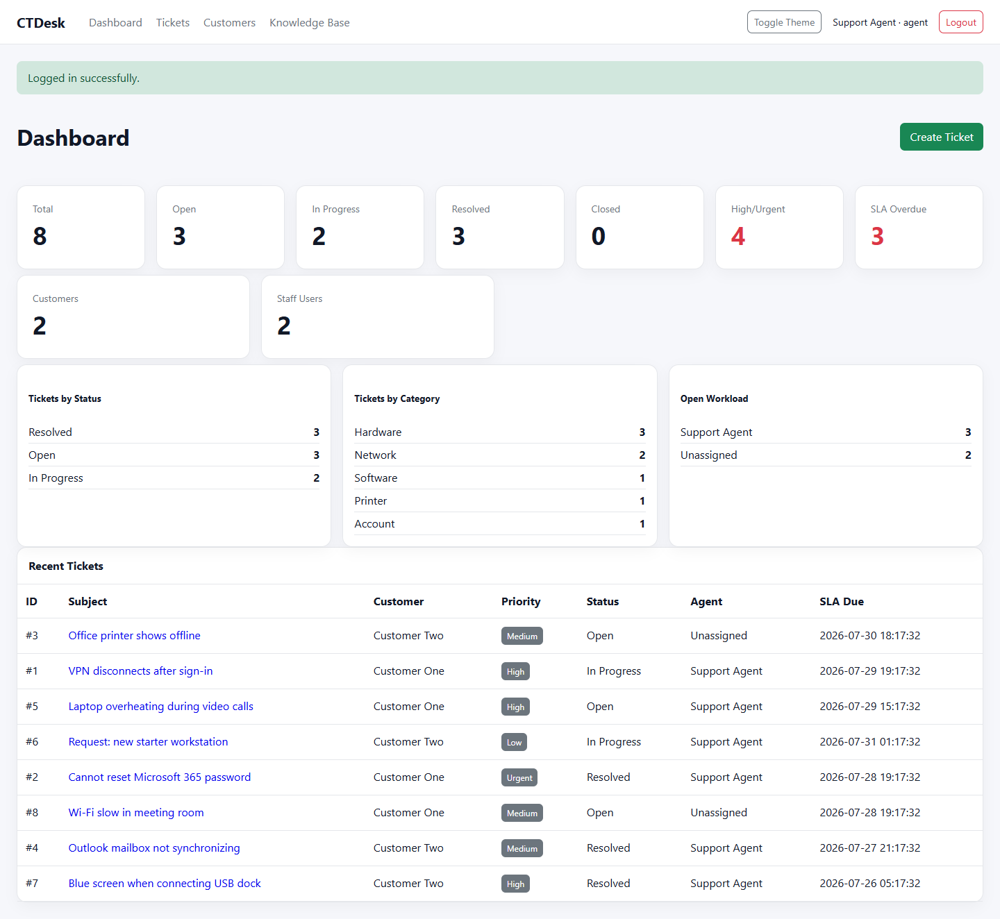
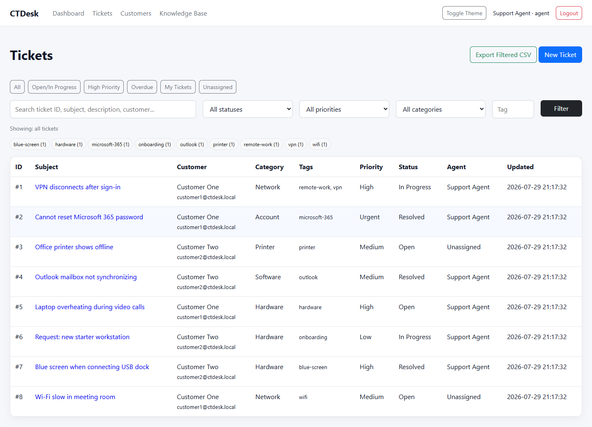
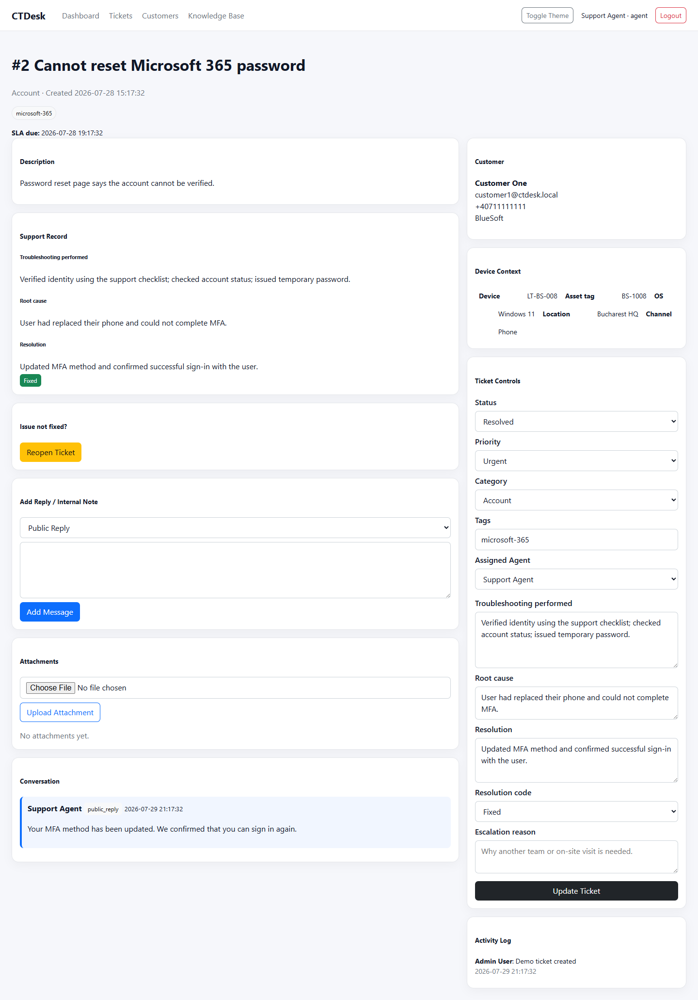
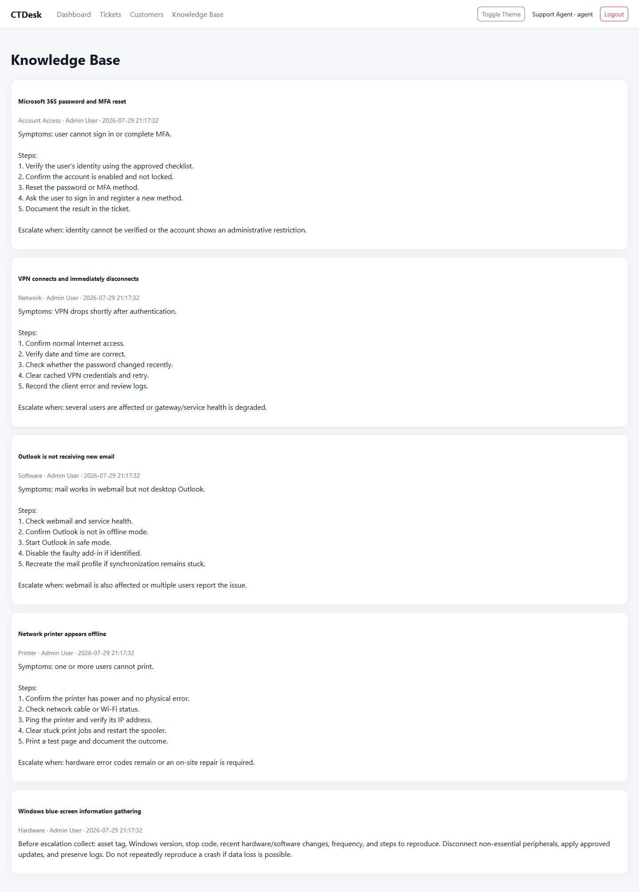
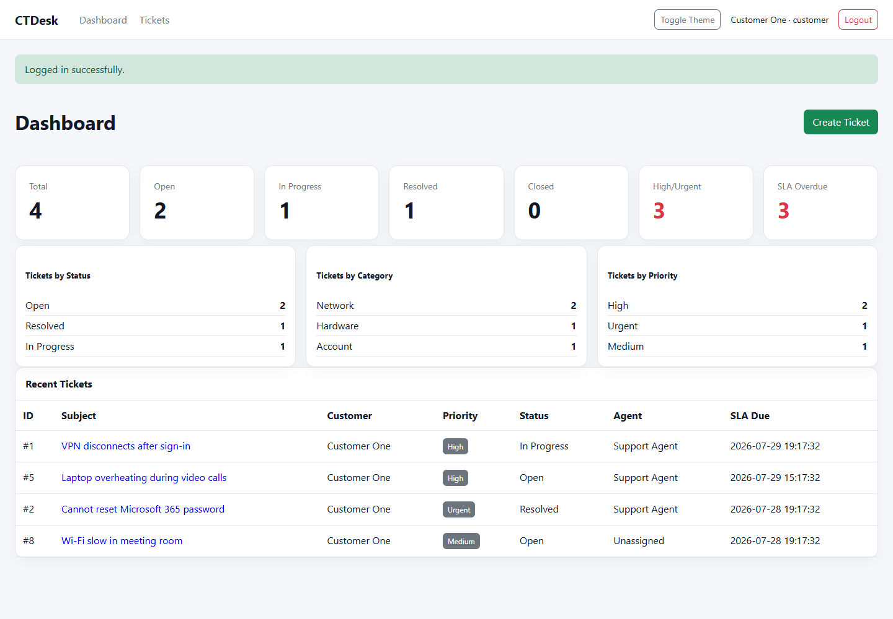
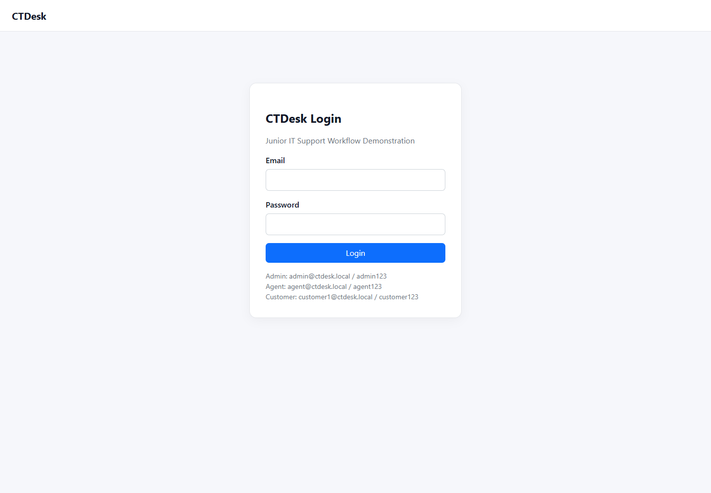

# CTDesk — IT Support Help Desk

CTDesk is a complete help-desk simulation created to demonstrate the practical skills expected from a junior IT support technician. It follows a support request from the moment a customer reports an issue until the technician investigates, communicates, documents the solution, and closes the ticket.

The project focuses on real support work rather than unnecessary technical complexity. It uses Python, Flask, SQLite, HTML and CSS so the application remains easy to understand, explain and maintain at junior level.



### Searchable ticket queue

The ticket queue shows realistic incidents and service requests. Agents can search, filter, use quick queues, review tags, identify unassigned work and export the current view.



### Fully documented resolved ticket

The ticket page combines the customer report, device context, troubleshooting, root cause, verified resolution, conversation, attachments, assignment controls and staff activity history.



### Structured knowledge base

The knowledge base contains reusable support procedures for Microsoft 365, VPN, Outlook, printers and Windows blue screens. Each article explains what to check and when escalation is appropriate.



### Customer portal

The customer dashboard presents only that customer's tickets and statistics. Staff-only pages, internal notes and operational activity are not exposed.



## What the application does

CTDesk provides separate experiences for administrators, support agents and customers.

Customers can sign in, create tickets, include device information, attach supporting files, follow public replies, and reopen an issue when the solution did not work. Customers can only access their own tickets and cannot see internal staff notes or activity records.

Support agents can:

- Review and triage incoming tickets
- Assign controlled categories and priorities
- Take ownership of tickets
- Record the device name, asset tag, operating system, location and support channel
- Add public replies or staff-only internal notes
- Document troubleshooting in the order it was performed
- Record the confirmed root cause
- Explain the final resolution and how it was verified
- Mark an outcome as fixed, workaround, user education, duplicate or escalated
- Record why another team or an on-site technician is required
- Search and filter the ticket queue
- Monitor SLA deadlines and overdue tickets
- Use documented knowledge-base procedures
- Export filtered ticket data to CSV

Administrators can also manage staff users, customer accounts and knowledge-base content.

## Why the project is relevant to IT support

The application demonstrates more than creating and editing database records. Its workflow shows the habits required in a support role:

- Gathering enough information before troubleshooting
- Understanding user impact and assigning priority consistently
- Separating customer communication from internal investigation notes
- Keeping a clear technical history of every action
- Protecting customer information with role-based access
- Knowing when to continue troubleshooting and when to escalate
- Verifying the fix with the user
- Turning repeated solutions into reusable documentation
- Recognizing response targets and overdue work

Customer-created tickets begin as **Unclassified**. A support technician reviews the impact and assigns the real priority before the SLA starts. This avoids allowing users to declare every issue urgent and demonstrates a simple, realistic triage process.

## Ticket lifecycle

```text
customer reports an issue
        ↓
support gathers device and impact information
        ↓
ticket is categorized prioritized and assigned
        ↓
troubleshooting and communication are documented
        ↓
issue is fixed worked around or escalated
        ↓
root cause resolution and verification are recorded
        ↓
ticket is resolved and closed or reopened if needed
```

## Main features

- Role-based authentication for admin, agent and customer accounts
- Customer ticket ownership protection
- Ticket triage, priority, assignment, category and status controls
- Device and asset information
- Public replies and private internal notes
- Structured troubleshooting and resolution records
- Escalation reasons and resolution codes
- File attachments with allowed-type and 8 MB limits
- SLA targets and overdue indicators
- Search, tags, filters and common support queues
- Dashboard statistics and agent workload
- Knowledge-base articles with symptoms, steps and escalation guidance
- Filtered CSV export
- Activity history for staff
- Light and dark themes
- Realistic sample tickets and resettable demo data
- Automated security, access-control and workflow tests

## Security and reliability

- Passwords are stored as secure hashes
- SQL statements use parameters
- POST forms use CSRF tokens
- Session cookies use `HttpOnly` and `SameSite=Lax`
- Customer access is limited to owned tickets
- Internal notes and activity history remain staff-only
- Upload types and file sizes are restricted
- Debug mode is disabled
- Duplicate emails return a friendly error
- Project paths do not depend on the folder used to launch Python
- The interface is styled locally and does not require internet access

## Application screenshots

### Login and demonstration accounts

The login screen provides clearly labeled local accounts so a recruiter can quickly test the administrator, support-agent and customer experiences.



### Support-agent dashboard

The agent dashboard gives an immediate overview of open work, priorities, overdue SLAs, category trends, agent workload and recently updated tickets.

## Included demonstration data

The project includes realistic examples involving:

- VPN disconnections after a password change
- Microsoft 365 password and MFA recovery
- An offline office printer
- Outlook synchronization failure
- Laptop overheating
- New-starter workstation preparation
- A blue screen caused by USB dock firmware
- Poor Wi-Fi coverage in a meeting room

The examples include resolved, open, assigned, unassigned, escalated and overdue work so the dashboard is useful immediately.

## Run the project on Windows

Double-click:

```text
run_ctdesk.bat
```

On the first run, the script creates a virtual environment, installs the requirements, creates the demo database when needed, and starts CTDesk at:

```text
http://127.0.0.1:5000
```

Run `reset_demo_data.bat` whenever you want to restore the original demonstration tickets.

## Demo accounts

| Role | Email | Password |
|---|---|---|
| Administrator | `admin@ctdesk.local` | `admin123` |
| Support agent | `agent@ctdesk.local` | `agent123` |
| Customer | `customer1@ctdesk.local` | `customer123` |
| Customer | `customer2@ctdesk.local` | `customer123` |

These accounts are for local demonstration only.

## Suggested recruiter demonstration

1. Sign in as a customer and report a VPN issue
2. Include the device name, operating system and location
3. Sign in as the support agent
4. Triage, prioritize and assign the ticket
5. Add an internal troubleshooting note
6. Send a clear public reply
7. Record the root cause, resolution and verification
8. Resolve the ticket and show the dashboard or knowledge base

## Run the automated tests

```powershell
python -m unittest discover -s tests -v
```

The eight tests cover authentication, protected pages, customer ticket ownership, staff permissions, internal-note privacy, CSRF protection, resolution documentation and filtered CSV export.

## Example SLA targets

| Priority | Target |
|---|---:|
| Urgent | 4 hours |
| High | 8 hours |
| Medium | 24 hours |
| Low | 48 hours |

## Known limitations

CTDesk is a local portfolio project rather than a production service. Email notifications are simulated, business-hour calendars are not calculated, uploaded files are stored locally, and SQLite is intended for a small demonstration workload.

These limits are intentional. The goal is to demonstrate strong IT support thinking and documentation without hiding the workflow behind enterprise infrastructure.
